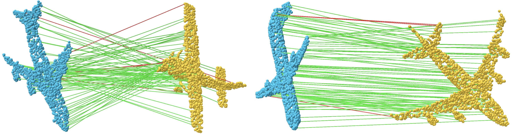

## `RIST`: 3D `R`otation-`I`nvariant Local `S`hape `T`ransform

>[Learning SO(3)-Invariant Semantic Correspondence via Local Shape Transform](https://arxiv.org/abs/2404.11156)\
> [Chunghyun Park<sup>1*</sup>](https://chrockey.github.io/),
> [Seungwook Kim<sup>1*</sup>](https://wookiekim.github.io/),
> [Jaesik Park<sup>2</sup>](http://jaesik.info/), and
> [Minsu Cho<sup>1</sup>](http://cvlab.postech.ac.kr/~mcho/) (*equal contribution)<br>
> <sup>1</sup>POSTECH and <sup>2</sup>Seoul National University<br>
> CVPR 2024, Seattle.

<div align="left">
  <a href="https://arxiv.org/abs/2404.11156"></a>
  <a href="https://chrockey.github.io/RIST/"></a>
</div>

<p align="center">
  
</p>

## Installation

```bash
curl -LsSf https://astral.sh/uv/install.sh | sh
uv sync
```

> [!NOTE]
> CUDA is required. CUDA extensions (Chamfer Distance, EMD, KNN) are JIT-compiled on first run. Tested on Python 3.12, PyTorch 2.11, CUDA 12.8, 8 NVIDIA A6000 GPUs.

## Training

```bash
# Dataset will be downloaded automatically on first run
# Train on KeypointNet airplane
uv run python src/train.py experiment=keypointnet

# Train with SO(3) augmentation
uv run python src/train.py experiment=keypointnet data.rotate=true

# Train on different category (e.g., chair)
uv run python src/train.py experiment=keypointnet data.category=chair
```

## Evaluation

```bash
# Evaluate with random SO(3) rotations (default)
uv run python src/eval.py experiment=keypointnet ckpt_path=<path_to_checkpoint>

# Evaluate without rotation
uv run python src/eval.py experiment=keypointnet data.rotate=false ckpt_path=<path_to_checkpoint>
```

## Acknowledgments

This project is built upon [CanonicalPAE](https://github.com/AnjieCheng/CanonicalPAE). KNN implementation is adapted from [Pointcept](https://github.com/Pointcept/Pointcept).

## Citation

If you find our work useful, please consider citing:

```bibtex
@inproceedings{park2024rist,
  title={Learning SO(3)-Invariant Semantic Correspondence via Local Shape Transform},
  author={Park, Chunghyun and Kim, Seungwook and Park, Jaesik and Cho, Minsu},
  booktitle={Proceedings of the IEEE/CVF Conference on Computer Vision and Pattern Recognition (CVPR)},
  year={2024}
}
```
